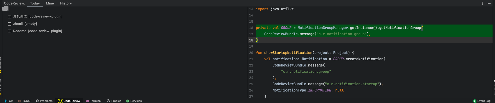

#Code Review Plugin

[ Download ](https://github.com/linh1020/code-review-plugin/releases/tag/0.01)

> 团队之间Code Review(Diff) 工具
> 
> 集成 Trello

## Get Start
### 配置Task
插件依赖IDEA task 插件的server信息
`Perferences -> Tools -> Tasks -> server`
添加Trello 服务

### 配置 Code Review Plugin
`Perferences -> Tools -> Code Review`

- Repository 选择 Trello
- Boards 选择Code review使用的板子
- 关闭 preferences

### 添加 Review 记录

点击 Icon 

输入comment 提交记录

### 查看Review 记录
点击屏幕下方的 ToolWindow 打开面板

勾选CheckBox 更新review记录状态 done
点击comment 右侧面板会关联显示之前记录的代码内容

可对代码直接编辑
